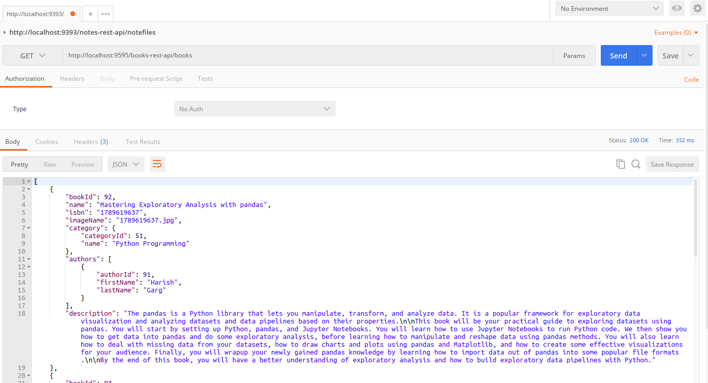
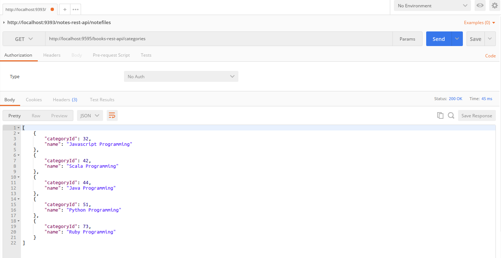
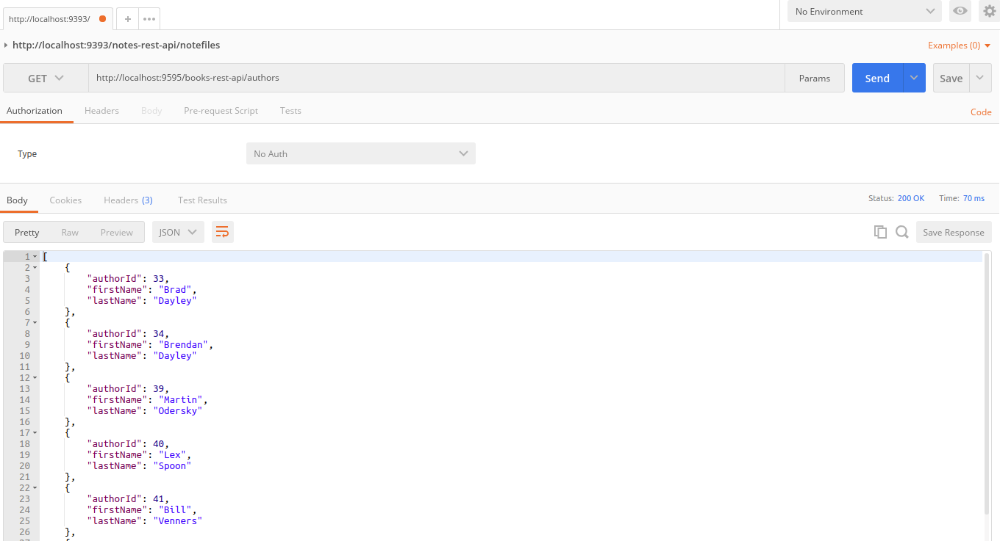

BOOKSTORE REST API
----------------------------------------------------------------------------------------

REST API built with Spring Boot, Spring Data JPA, Maven and PostgreSQL.

This app contains three simple Rest Services that deal with information about
books, categories and authors.

----------------------------------------------------------------------------------------

Get call to service "books" from Postman:

----------------------------------------------------------------------------------------

Get call to service "categories" from Postman:

----------------------------------------------------------------------------------------

Get call to service "authors" from Postman:

----------------------------------------------------------------------------------------

